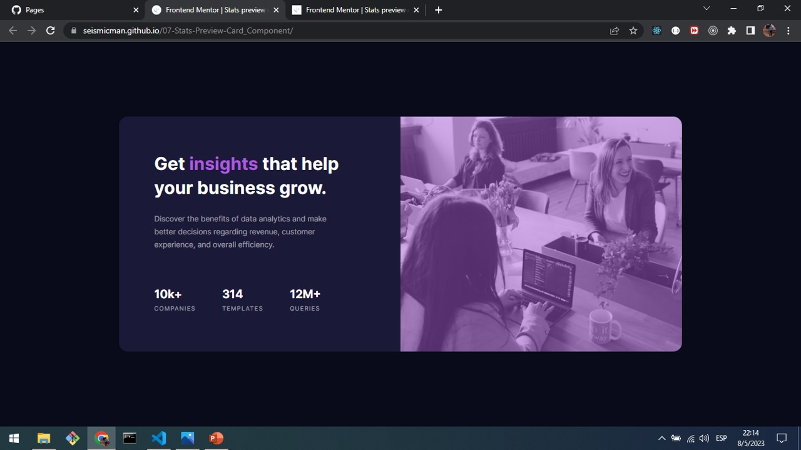
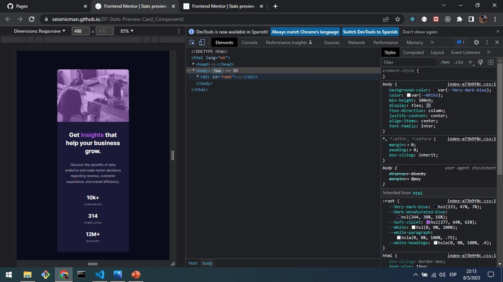

# Frontend Mentor - Stats preview card component solution

This is a solution to the [Stats preview card component challenge on Frontend Mentor](https://www.frontendmentor.io/challenges/stats-preview-card-component-8JqbgoU62). Frontend Mentor challenges help you improve your coding skills by building realistic projects.

## Table of contents

- [Overview](#overview)
  - [Screenshot](#screenshot)
  - [Links](#links)
- [My process](#my-process)
  - [Built with](#built-with)
  - [What I learned](#what-i-learned)
  - [Continued development](#continued-development)
  - [Useful resources](#useful-resources)
- [Author](#author)

## Overview

### Screenshot

### Links

Solution URL: [https://seismicman.github.io/06-Order-Summary-Component/](https://seismicman.github.io/06-Order-Summary-Component/)

## My process

### Built with

- Semantic HTML5 markup
- CSS custom properties
- Flexbox
- [React](https://reactjs.org/) - JS library

### What I learned

Although this is a project that mainly we can develop in HTML and CSS, I developed it in React as an unique component and CSS for the styles. The most important part was how do we overlay a background image in CSS. Also, it was very useful to understand Flexbox to organize the different components of the User Interface and the use of media queries to switch between desktop and mobile versions.

### Continued development

I would like to continue developing this challenges using React as main resource and complementing with other ones as HTML5, CSS, SAAS, among others

### Useful resources

- [www.csstricks.com <- To keep updated about CSS](https://css-tricks.com/) - This an amazing site with a lot of articles about the world of CSS.
- [https://jonmircha.com/cursos <- To learn about frontend resources](https://jonmircha.com/cursos) - This is an amazing spanish channel when do you can learn about HTML5, CSS, React, Git and Github, among others. I'd recommend it to anyone still learning about these resources.

## Author

- Frontend Mentor - [@seismicman](https://www.frontendmentor.io/profile/seismicman)
